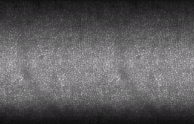
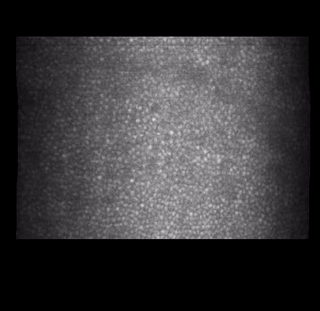
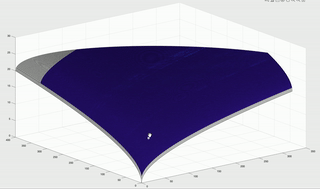
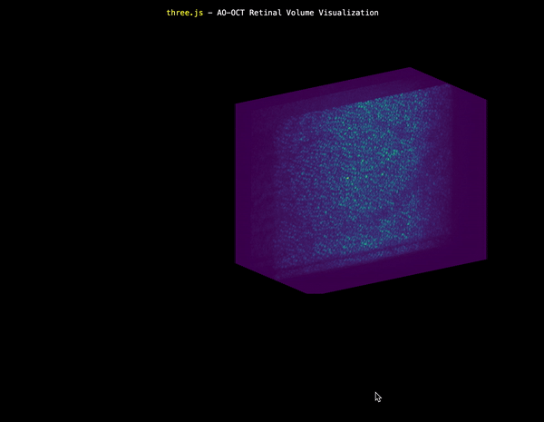
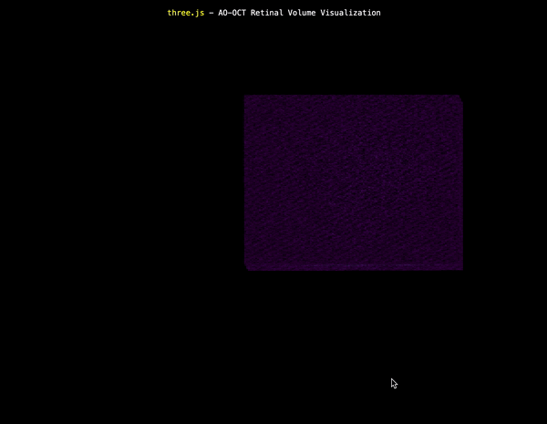
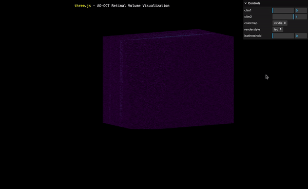

## Above is a series of 39 unregistered C-scans.

## Registered volumes using patch-based algorithm. The left half of the gif is the algorithm output, and the right is the original unregistered data.

## Registered C-scans via R-SLAM. 

## Example of arbitrary surface slice for retinal volume. This MATLAB-based visualizer responds to user clicks and drags with no lag.

## Registered volume visualized in three.js software using maximum intensity projection (MIP).

## Registered volume visualized in three.js software using isosurfaces (ISO).

## Registered volume visualized in three.js software using isosurfaces (ISO). Visualizer includes intensity thresholding feature. Increasing the intensity threshold highlights brighter features in the retinal volume including cone cells.
